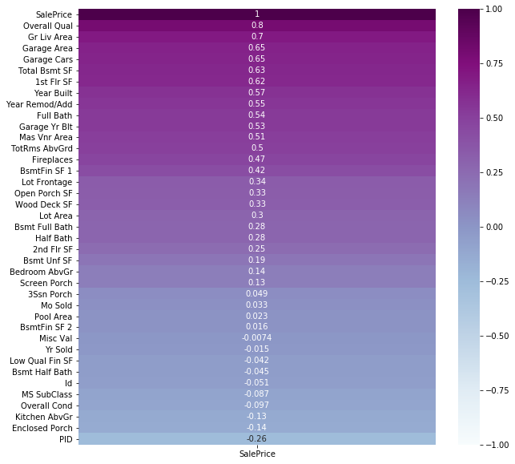
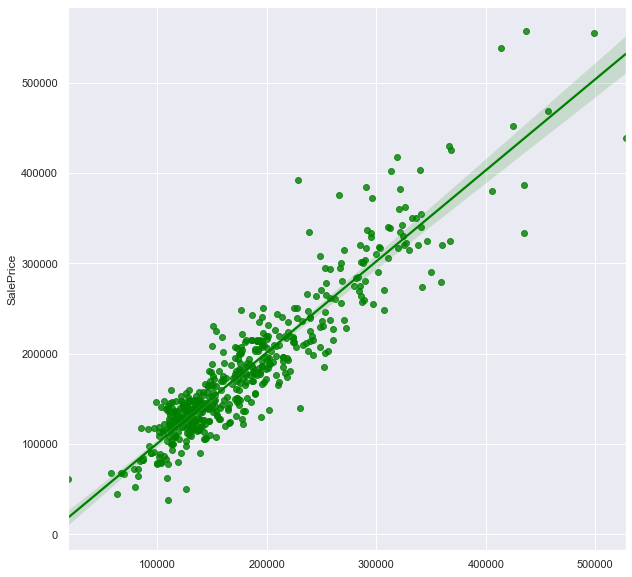

# NOSTRADAMUS RESEARCH COMPANY
# AMES, IA HOUSING PRICES PREDICTION REPORT

Our anonymous client has contacted our Seattle Office regarding their possible real estate investments in Ames, IA. Based upon their request, Nostradamus Research Company premium clients department prepared this technical report and high level presentation that includes findings and recommendations.

---

### THE PURPOSE OF THIS REPORT

The purpose of this report is to provide the client with 3 components. Our first component includes the defining parameters and indicators of housing prices in Ames, IA 2006-2010. The second component includes predictions based on the client's data. Finally, we include and present recommendations based on our modeled predictions. 
Our team used 2006 - 2010 Ames, IA housing prices dataset to build linear regression model, predicting housing prices in order to satisfy our clients request.

---

### EXECUTIVE SUMMARY

Our team analyzed 2051 house transactions in Ames, IA. This represent approximately 8% of the houses in the city.(1) For each transaction, the team used over 200 dependent and independent parameters.  
The study shows strong evidence that ***overall quality of the house, overall condition of the house, total living area, number of bedroom, kitchen, and bathroom, garage size, whether it has a fireplace or not are the most important factors.*** More importantly, these parameters can very well effect each other. Simply looking at these parameters is insufficient to understand the price changes. Addition to these parameters, their combinations are also important elements of the price.  
Nostradamus Research Company premium clients department developed over 10 models to predict the most accurate prices in Ames. Based on our best model, we can explain 87 % of the changes in housing sales price by evaluating those factors.  
In the report we further showed that how much each of these factors affect the sales price individually (in ceteris paribus).
Also, based on the 80 parameters of 878 houses, we used our model and predicted the sales prices. 
Finally, we recommend our client to use these parameters, with their combinations, when the investment decisions during any financial recession. Also, our model (Model-11) is the best model to predict prices, when the parameters are given.  

---

### METHODOLOGY

We obtained 2051 house transactions with 80 independent parameters and 1 dependent parameter (SalePrice). Our team studied hours to clean the data in order to make the best prediction model, each parameters effect on sales price was analyzed.  
Thirty-nine of these independent variables are numerical and the remaining are non-numerical.  
We studied the correlation between both numerical and non-numerical variables and SalePrice. Below table shows the correlation numbers between numerical parameters and SalePrice.

*Note: Please view the [Data dictionary](../Project%202/assets/Data_Dictionary.md).*

After we prioritized the variables based on the above heatmap; we decided to use below non-numerical and numerical columns as predictors.  

- Non-Numerical predictors:

>`MS Zoning`

>`Neighborhood`

>`Kitchen Qual`

- Numerical predictors:

>`MS SubClass`

>`Overall Qual`

>`Overall Cond`

>`Fireplaces`

>`Gr Liv Area`

>`Full Bath`

>`Bedroom (Bedroom AbvGr)`

>`Kitchen (Kitchen AbvGr)`

>`Garage Cars`

>`Mo Sold`

>`Year Built`

>`Year Remod/Add`

We developed 13 models, based on using above parameters.

|           | Parameters                           | R2 Cross Val Score    |
|---|--------------------------------------|-----------------------|
|  Model 1  | MS SubClass                          |     23%               |
|  Model 2  | MS Zoning                            |     15%               |
|  Model 3  | Neighborhood                         |     55%               |
|  Model 4  | Kitchen Quality                      |     48%               |
|  Model 5  | Time and Age variables               |     38%               |
|  Model 6  | Multiple variables and combinations  |     75%               |
|  Model 7  | Multiple variables and combinations  |     78%               |
|  Model 8  | Multiple variables and combinations  |     80%               |
|  Model 9  | Multiple variables and combinations  |     80%               |
|  Model 10 | Multiple variables and combinations  |     85%               |
|  Model 11 | Multiple variables and combinations  |     **87%**           |
|  Model 12 | Multiple variables and combinations  |     86%               |
|  Model 13 | Multiple variables and combinations  |     90%               |

---

All of the models outperformed the baseline. In the first 4 models, we used non-numerical variables. In these we suffered from high bias. Both in train and split datasets, the variance was very low.  

In Models 5, 6, 7, 8, and 9, we used multiple variables and their interactions columns. This is how we reached to 200 parameters. In these models, we gradually increase the variance of determination. As our bias decreased, our variance has increased.  
Finally, we added normalization methods such as `Ridge and LASSO analysis` in order to decrease the variance while not increasing the bias.  

### CONCLUSION AND RECOMMENDATION

Our best performing model is [Model-11](../project_2-master/code/datasets/modedl_11_submission.csv). We measured the effect of  **overall quality of the house, overall condition of the house, total living area, number of bedroom, kitchen, and bathroom, garage size, fireplace.** on SalePrice in the model.
Both, train/test split and cross validation techniques were utilized. Model-11 explains 87 % of the variance in housing SalePrice by the variance in stated parameters.

Also, we used scikit-learn  PolynomialFeatures function to create interaction columns. In order to decrease the variance, we added Ridge and LASSO analyze models. After we used these 2 normalization techniques, the difference between train data coefficient of determination score and test data coefficient of determination score was negligible.

You can see the plot showing the predictions vs the true values of testing data and our regression line with confidence interval. x line is showing predictions, and y line is showing true values of testing dataset.

We recommend our client to use these parameters, with their combinations, when the investment decisions during any financial recession. Also, our model (Model-11) is the best model to predict prices, when the parameters are given. 
As the last step of our report, our anonymous client supplied us a list of 878 houses with 80 parameters. We used our model (Model-11) and predicted the sales prices. 

### DATA DICTIONARY

Please click [here](../Project%202/assets/Data_Dictionary.md)  for Data Dictionary

### OUTSIDE REFERENCES
Based on Deloitte & Datawheel ’s report at https://datausa.io/
